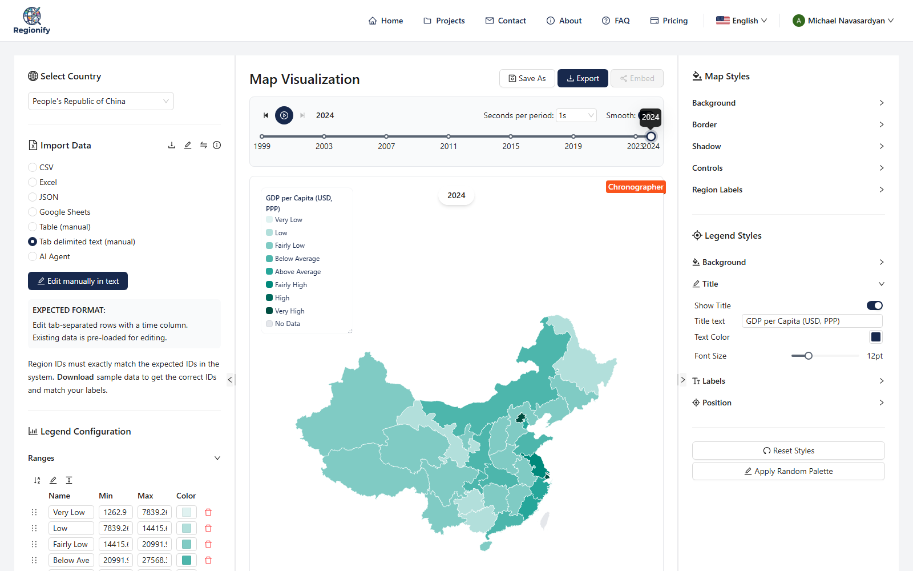
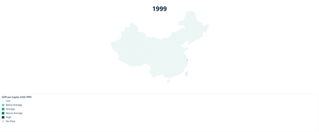
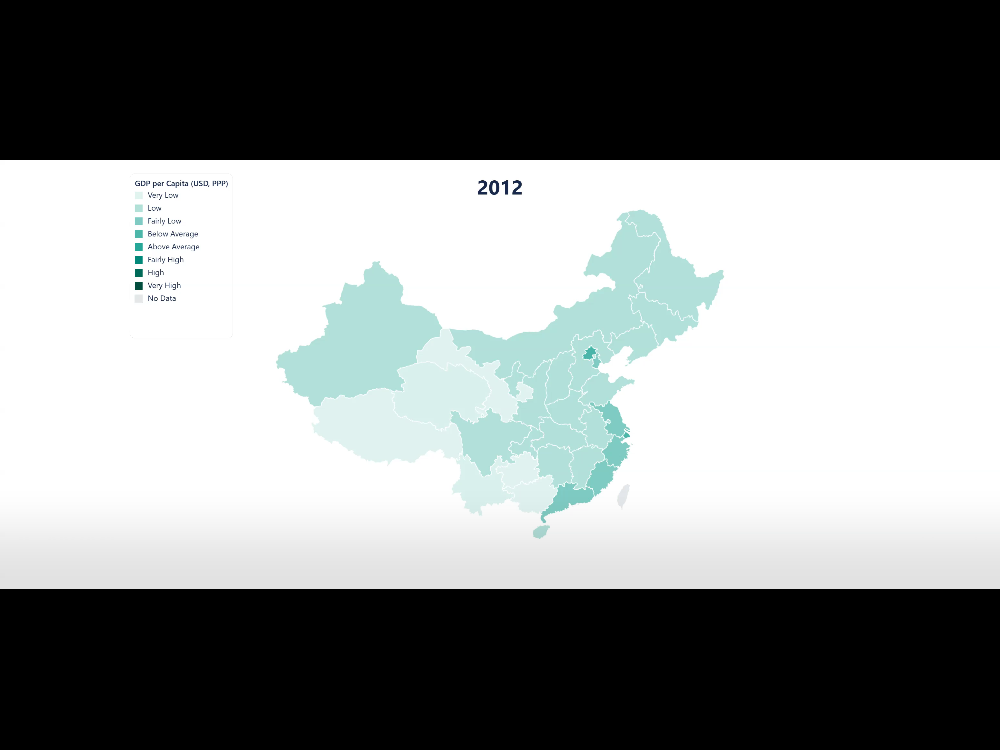

# Medium Article — How to Export an Animated Map (GIF, MP4)

## Meta

| Field         | Value                                                         |
| ------------- | ------------------------------------------------------------- |
| Platform      | Medium (submit to a publication — see `../README.md`)         |
| Day           | Wednesday                                                     |
| Time slot     | 8-10 AM US Eastern (4-6 PM UTC+4)                             |
| Length target | 500-700 words / ~3 minute read                                |
| Tags          | Data Visualization, JavaScript, SEO, Tutorial, No Code        |
| UTM campaign  | `animated-map-export`                                         |
| Canonical URL | The Medium URL itself (set as canonical on dev.to / Hashnode) |

This is a narrow how-to: turning a time-series dataset into an animated map, then exporting the same map two ways — animated GIF and MP4 video — demonstrated with 26 years of real OECD GDP-per-capita data for China's 31 provinces.

---

## Title — pick ONE

**Primary:**

```
How to Turn a Spreadsheet Into an Animated Map — and Export It as GIF or MP4
```

**Backup 1 (search-intent forward):**

```
Animated Map Export: GIF vs. MP4, and When to Use Each
```

**Backup 2 (data-story-forward):**

```
25 Years of China's Provinces Getting Richer, Turned Into an Animated Map
```

## Subtitle — pick ONE

**For Primary title:**

```
One time-series dataset, one styled map, two export formats — a short walkthrough using 26 years of Chinese provincial GDP data.
```

---

## Article body (paste as-is into the Medium editor after picking title/subtitle)

> **Formatting note.** Medium's editor accepts pasted Markdown. Images below are referenced by relative path — upload each to Medium manually at its marked position (drag-and-drop into the editor), since Medium doesn't hot-link local files. Medium doesn't support direct MP4 upload either — see the note under Step 3.

---

<!--
HERO IMAGE
- Use docs/marketing/medium/animated-map-export/china-gdp-styled-map.png, cropped 2:1 (1500x750) if a hero is wanted.
- Alt text: "Animated choropleth map of China's GDP per capita by province, 1999-2024, in Regionify"
-->

A map with one color per region is a snapshot. A map that changes color as time passes is a story. In 1999, Guizhou's GDP per capita was $1,263 — by 2024 it was $13,891, an 11x increase. Shanghai went from $14,099 to $51,326 over the same stretch. A single static map can't show that arc; an animated one does it in a few seconds.

[Regionify](https://regionify.pro/?utm_source=medium&utm_medium=article&utm_campaign=animated-map-export) turns any dataset with a time column into that kind of map, then exports it as whichever file format your audience actually opens. Here's the walkthrough, using real [OECD regional GDP-per-capita data](https://data-explorer.oecd.org) for China's 31 provinces (1999–2024) as the running example — imported the same way as any other Regionify project, with a `year` column alongside the region ids and values.

### Step 1 — Style it once, it applies to every frame

Set a legend title, pick a palette, and normalize the ranges to the dataset's real min/max. Do this once and it carries through every year and every export format below. The legend itself is draggable too — dropped it a little closer to the map here than its default top-left corner:



### Step 2 — Export as an animated GIF

**Export → GIF (Animation).** Pick a quality and a per-frame duration, crop, download — the full 1999–2024 sequence compresses into one file that autoplays anywhere a raster image works: Slack, README files, email, Medium itself.



### Step 3 — Export as an MP4 video

Same panel, switch the export type to **Video (MP4)**. For a multi-decade animation like this one, the video comes out noticeably smaller than the GIF at comparable quality — better for a slide deck, or for posting natively to LinkedIn/X, where video autoplay outperforms an image upload. (Medium doesn't accept a raw MP4 upload — post the video natively on LinkedIn/X or YouTube, then link to it, the same way the embed-guide article links out to its live demo instead of embedding one directly.)



### Which tier you need

- **Observer (free)** — static PNG/JPEG/PDF export only. No time-series import, so no animated export either.
- **Explorer ($49 once)** — adds time-series data import plus the GIF and MP4 animation export shown above.

### Try it

Pick any map on [Regionify.pro](https://regionify.pro/?utm_source=medium&utm_medium=article&utm_campaign=animated-map-export), import a dataset with a year column, and export the same map as GIF and MP4 — pick whichever fits where you're publishing it. If you build something worth sharing, send me the link.

---

## Media assets — consolidated brief

| #   | Type       | Placement | File (relative to this article)   | Notes                                                      |
| --- | ---------- | --------- | --------------------------------- | ---------------------------------------------------------- |
| 1   | Screenshot | Step 1    | `china-gdp-styled-map.png`        | Styled 2024 map, floating legend dragged closer to the map |
| 2   | GIF        | Step 2    | `china-gdp-animation-preview.gif` | Compressed for inline embedding                            |
| 3   | Screenshot | Step 3    | `china-gdp-video-preview.png`     | Native video player, mid-animation frame                   |

**Source data:** `docs/marketing/assets/data/oecd-gdp-china.csv` — OECD Regional Database, GDP per capita (`GDP`, USD PPP-converted), TL2 regions, China, 1999–2024. Filtered and remapped from `docs/marketing/assets/data/oecd-gdp-per-capita.csv` to match `client/src/assets/images/maps/china.svg`'s exact region titles.

**A real bug surfaced and fixed while building this dataset:** china.svg's Tibet path had a trailing space in its `title` attribute (`"Xizang (Tibet) "`). The import pipeline trimmed every parsed region id, but the map-coloring code read the SVG's `title` attribute raw — so no dataset could ever match Tibet; it always rendered "No Data." Fixed two ways, independently: the trailing space was removed directly in `client/src/assets/images/maps/china.svg`, and separately `mapDataToSvgRegions` (`client/src/helpers/textSimilarity.ts`) was wired up to match region ids by normalized (whitespace/case/diacritic-insensitive) equality before falling back to similarity matching — so imports are now robust to this kind of formatting mismatch generally, not just for Tibet. Both fixes are deployed; the assets above were regenerated after deploy and show full data coverage.

**Raw downloadable deliverables** (not used in the article itself, but kept for cross-posts or cross-checking):

- `docs/marketing/medium/animated-map-export/china-gdp-animation.gif` — full-quality GIF (~27 MB)
- `docs/marketing/medium/animated-map-export/china-gdp-video.mp4` — the exported MP4 (~2 MB)

**Regenerating these assets:**

```
pnpm --filter @regionify/marketing exec tsx scripts/playwright-china-gdp-animated-export.ts
```

Requires `marketing/.env` with `CLIENT_URL`, `REGIONIFY_EMAIL`, `REGIONIFY_PASSWORD` (Explorer-tier account or higher), and `ffmpeg` (system PATH or the bundled `ffmpeg-static` dev dependency) for the compressed GIF preview. Unlike the embed-guide script, this one never saves the project — every export here is a local file download, so there's nothing to delete between runs.

---

## Cross-post checklist (execute 3-5 days after Medium publication)

- [ ] **dev.to** — canonical URL set to the Medium article. Tags: `webdev`, `seo`, `tutorial`, `datavisualization`.
- [ ] **Hashnode** — canonical URL set to the Medium article.
- [ ] **LinkedIn** — native post linking to the article (not a LinkedIn Article), with the MP4 uploaded natively (LinkedIn video autoplay gets far more reach than a link).

## Compliance checklist (before Publish)

- [ ] All 3 images inserted at their marked positions, each with alt text
- [ ] GIF renders inline (not as a static first-frame thumbnail) after Medium upload — verify in preview
- [ ] Every quoted GDP figure re-verified against `oecd-gdp-china.csv` if this article is edited
- [ ] No AI-tone giveaway phrases ("delve", "in the realm of", "furthermore", "it is important to note")
- [ ] Article read out loud once
