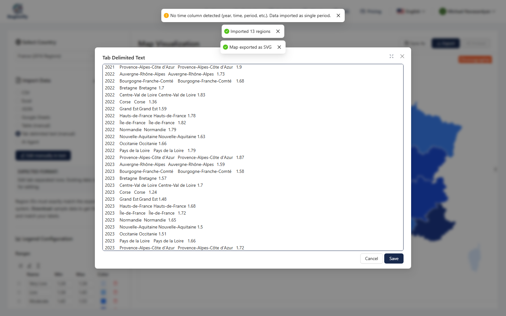
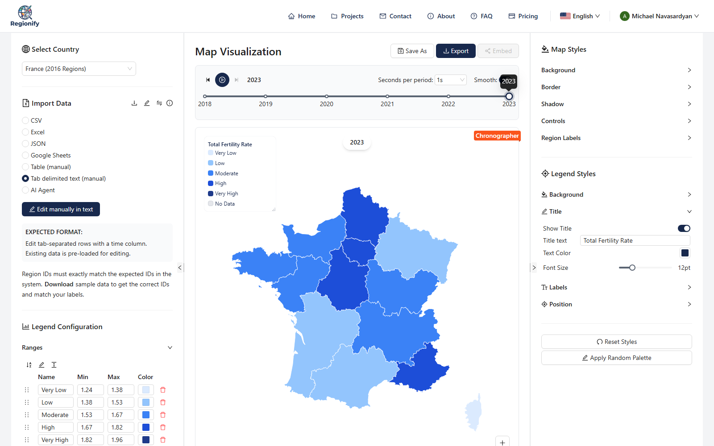
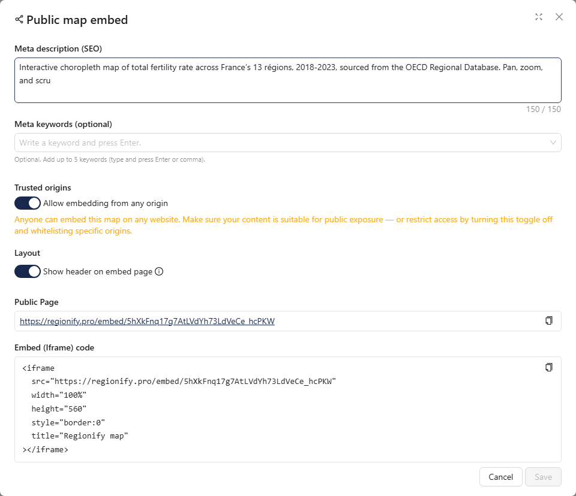
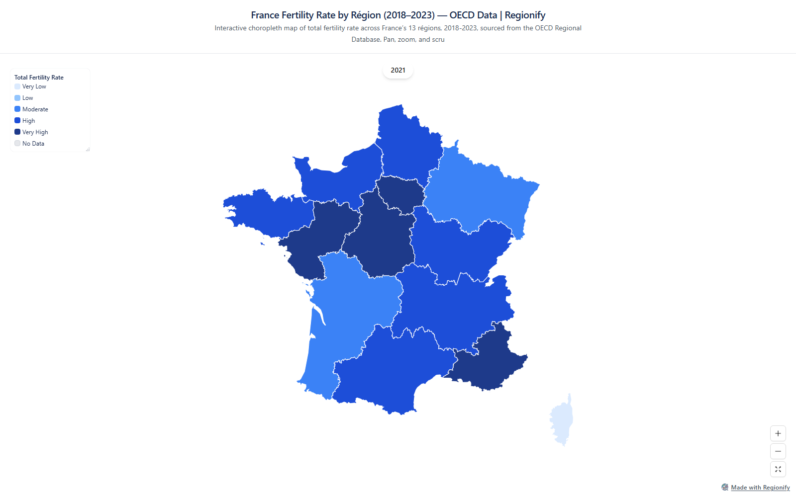

# Medium Article — How to Embed a Live Regional Map on Any Website

## Meta

| Field         | Value                                                          |
| ------------- | -------------------------------------------------------------- |
| Platform      | Medium (submit to a publication — see `../README.md`)          |
| Day           | Thursday                                                       |
| Time slot     | 8-10 AM US Eastern (4-6 PM UTC+4)                              |
| Length target | 700-950 words / 4-5 minute read                                |
| Tags          | Data Visualization, Web Development, SEO, JavaScript, Tutorial |
| UTM campaign  | `embed-guide`                                                  |
| Canonical URL | The Medium URL itself (set as canonical on dev.to / Hashnode)  |

This is a narrow how-to: generating a live iframe embed of a regional choropleth map in Regionify and dropping it on a website, then covering the interactivity, SEO, and AI-visibility it unlocks — demonstrated end-to-end with a real OECD dataset.

---

## Title — pick ONE

**Primary (how-to, iframe-focused):**

```
How to Embed a Live, Interactive Regional Map on Any Website
```

**Backup 1 (feature-forward):**

```
Turn Any Dataset Into a Live, Embeddable Map — Step by Step
```

**Backup 2 (data-story-forward):**

```
France's Fertility Rate, Region by Region — and How I Turned It Into an Embeddable Map
```

## Subtitle — pick ONE

**For Primary title:**

```
A step-by-step walkthrough — from raw data to a live iframe on your site — using real OECD regional fertility data for France.
```

---

## Article body (paste as-is into the Medium editor after picking title/subtitle)

> **Formatting note.** Medium's editor accepts pasted Markdown. Images below are referenced by relative path — upload each to Medium manually at its marked position (drag-and-drop into the editor), since Medium doesn't hot-link local files.

---

<!--
HERO IMAGE
- Use docs/marketing/medium/embed-guide/oecd-fertility-embed-page.png, cropped 2:1 (1500x750) if a hero is wanted.
- Alt text: "Interactive choropleth map of France's fertility rate by région, embedded via Regionify"
-->

If you've ever needed to put a regional map — sales by state, election results by province, fertility rates by région — on a website, the usual options are a flat screenshot that kills all interactivity, or a mapping library that costs you an afternoon of GeoJSON and projection math.

[Regionify](https://regionify.pro/?utm_source=medium&utm_medium=article&utm_campaign=embed-guide) generates a live, interactive map from your data and gives you a single `<iframe>` snippet to drop on any page — pan, zoom, per-region hover, and (for time-series data) a timeline scrubber, no map library involved. Here's the full walkthrough, using real [OECD regional fertility data](https://data-explorer.oecd.org) for France's 13 régions (2018–2023) as the running example, from raw spreadsheet to a working embed on a page.

### Step 1 — Pick a map and import the data

Pick a country map from [Regionify's 200+ administrative maps](https://regionify.pro/?utm_source=medium&utm_medium=article&utm_campaign=embed-guide). For this example: **France (2016 Regions)** — the current 13-région map, matching the OECD's TL2-level regional breakdown.

One thing to get right on paste: region ids need to match the map's own labels exactly — French "Bretagne," not the OECD's English exonym "Brittany." Regionify's sample-data download (the small icon above the paste box) gives you the canonical id list for whichever map you picked, which is the fastest way to align your spreadsheet before pasting.



Because the dataset spans six years (2018–2023), Regionify automatically drops into **time-series mode** — the timeline scrubber above the map appears the moment it detects more than one time period per region.

### Step 2 — Style it

Set a legend title, normalize the color ranges to the data's real min/max, pick a palette. Takes under a minute:



### Step 3 — Turn on the public embed

This needs a Chronographer-tier project (see pricing below). Click **Embed**, toggle it on, fill in an SEO title and description (these render server-side, so they're what Google and AI answer engines actually see), choose whether to allow embedding from any origin, and save:



Regionify generates the snippet for you:

```html
<iframe
  src="https://regionify.pro/embed/5hXkFnq17g7AtLVdYh73LdVeCe_hcPKW"
  width="100%"
  height="560"
  style="border:0"
  title="Regionify map"
></iframe>
```

### Step 4 — Paste it into your site

Copy that snippet into wherever your site accepts raw HTML — a Custom HTML block in WordPress, an Embed element in Webflow, a Code block in Squarespace, or straight into a plain `<body>`. No build step, no npm install, no map library to wire up.

Medium strips raw `<iframe>` tags from published posts, so here's what that snippet actually renders as on a page that allows it — full pan/zoom/hover, timeline included:

[Open the live embed →](https://regionify.pro/embed/5hXkFnq17g7AtLVdYh73LdVeCe_hcPKW?utm_source=medium&utm_medium=article&utm_campaign=embed-guide)



### What that one iframe gets you

- **It's interactive.** Pan, zoom, per-region hover/tooltip, and — because this dataset spans six years — a timeline scrubber that plays 2018 through 2023 right inside the embed.
- **It stays in sync.** Edit the source project later (new data, a different palette) and every page embedding it updates automatically. No re-export, no re-upload, no broken screenshot left behind on some page you forgot about.
- **It's indexable.** The embed page isn't a JavaScript-only SPA shell — it's server-rendered with its own `<h1>`, meta description, and structured data per project. Every embed is a real crawlable URL with unique, topic-specific metadata — "France Fertility Rate by Région (2018–2023)" is a long-tail query with near-zero competition that a generic homepage would never rank for.
- **It's AI-citable.** That same structured, factually-dense HTML that helps Google rank it also reads well as source material for AI answer engines (Perplexity, ChatGPT, Claude) when they're asked geography- or statistics-adjacent questions — the same content model behind Regionify's [200+ country landing pages](https://regionify.pro/?utm_source=medium&utm_medium=article&utm_campaign=embed-guide).
- **It links back.** The "Made with Regionify" watermark on the embed is a live backlink, so every map you publish is simultaneously a widget on your page and a two-way SEO asset.
- **It works almost anywhere.** Any site that allows `<iframe>` — no map library, no JavaScript bundle, no API keys to manage on your end.

### Which tier you need

- **Observer (free)** — static PNG/JPEG/PDF export only. No embed.
- **Explorer ($49 once)** — adds time-series data import plus SVG and animated GIF/MP4 export, if you ever need a static asset instead of a live embed.
- **Chronographer ($149 once)** — adds the public iframe embed used above, plus a bigger AI-parser allowance.

### Try it

Pick any map on [Regionify.pro](https://regionify.pro/?utm_source=medium&utm_medium=article&utm_campaign=embed-guide), paste a dataset, and generate your own live embed. If you build something worth sharing, send me the link — I like seeing what people map.

---

## Media assets — consolidated brief

| #   | Type       | Placement | File (relative to this article)   | Notes                                 |
| --- | ---------- | --------- | --------------------------------- | ------------------------------------- |
| 1   | Screenshot | Step 1    | `oecd-fertility-import-panel.png` | Data-import panel, OECD data pasted   |
| 2   | Screenshot | Step 2    | `oecd-fertility-styled-map.png`   | Styled 2023 map, panels visible       |
| 3   | Screenshot | Step 3    | `oecd-fertility-embed-modal.png`  | Embed modal, SEO fields + iframe code |
| 4   | Screenshot | Step 4    | `oecd-fertility-embed-page.png`   | The live public embed page            |

**Source data:** `docs/marketing/assets/data/oecd-fertility-france.csv` — OECD Regional Database, fertility rate (`FERT_RATIO`, `AGE=Total`), TL2 regions, France, 2018–2023. Fetched live from the OECD SDMX API (`OECD.CFE.EDS:DSD_REG_DEMO@DF_FERTILITY`).

**Raw downloadable deliverables** (not used in this iframe-focused version of the article, but kept for cross-posts or a follow-up "other export formats" piece):

- `docs/marketing/medium/embed-guide/france-oecd-fertility.svg` — full-resolution SVG (~60 KB)
- `docs/marketing/medium/embed-guide/france-oecd-fertility-animation.gif` — full-quality GIF (~13 MB)
- `docs/marketing/medium/embed-guide/france-oecd-fertility-embed-url.txt` — the live embed URL
- `docs/marketing/medium/embed-guide/france-oecd-fertility-embed-code.txt` — the iframe snippet

**Regenerating these assets:**

```
pnpm --filter @regionify/marketing exec tsx scripts/playwright-oecd-france-fertility.ts
```

Requires `marketing/.env` with `CLIENT_URL`, `REGIONIFY_EMAIL`, `REGIONIFY_PASSWORD` (Chronographer-tier account). Re-running creates a **new** project + a **new** public embed URL each time — delete the old "France — OECD Fertility Rate (2018–2023)" project first if you don't want duplicates (Projects page → search → Delete).

---

## Cross-post checklist (execute 3-5 days after Medium publication)

- [ ] **dev.to** — canonical URL set to the Medium article. Tags: `webdev`, `seo`, `tutorial`, `datavisualization`.
- [ ] **Hashnode** — canonical URL set to the Medium article.
- [ ] **LinkedIn** — native post linking to the article (not a LinkedIn Article), pull-quote the SEO/GEO section.
- [ ] **r/webdev or r/dataisbeautiful** — if posting the live embed URL itself (not the article), see `../../reddit/week-03/08-maps-interactive-embed.md` for the interactive-embed posting playbook.

## Compliance checklist (before Publish)

- [ ] All 4 images inserted at their marked positions, each with alt text
- [ ] Live embed URL tested in an incognito window before publishing
- [ ] UTM link (`embed-guide`) tested — shows up in analytics
- [ ] Pricing tier claims verified against current Observer/Explorer/Chronographer config
- [ ] No AI-tone giveaway phrases ("delve", "in the realm of", "furthermore", "it is important to note")
- [ ] Article read out loud once
