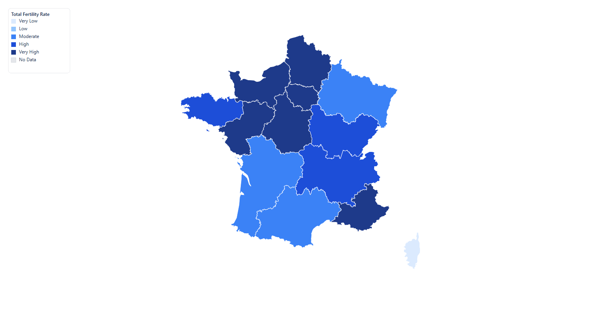
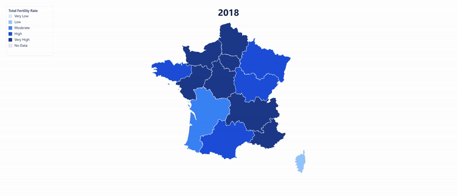

# Medium Article — How to Generate an Embeddable Choropleth Map

## Meta

| Field         | Value                                                          |
| ------------- | -------------------------------------------------------------- |
| Platform      | Medium (submit to a publication — see `../README.md`)          |
| Day           | Thursday                                                       |
| Time slot     | 8-10 AM US Eastern (4-6 PM UTC+4)                              |
| Length target | 700-950 words / 4-5 minute read                                |
| Tags          | Data Visualization, Web Development, SEO, JavaScript, Tutorial |
| UTM campaign  | `embed-guide`                                                  |
| Canonical URL | The Medium URL itself (set as canonical on dev.to / Hashnode)  |

This is a narrow how-to: generating an embeddable regional choropleth map in Regionify, in three concrete output formats, demonstrated end-to-end with a real OECD dataset.

---

## Title — pick ONE

**Primary (how-to, keyword-forward):**

```
How to Generate an Embeddable Choropleth Map — Live iframe, SVG, or GIF
```

**Backup 1 (SEO-forward, long-tail):**

```
Embedding an Interactive Regional Map on Your Site: iframe vs. SVG vs. GIF
```

**Backup 2 (data-story-forward):**

```
France's Fertility Rate, Region by Region — and How I Turned It Into an Embeddable Map
```

## Subtitle — pick ONE

**For Primary title:**

```
Three ways to drop a data-driven map into any page — a real walkthrough using OECD regional fertility data for France.
```

---

## Article body (paste as-is into the Medium editor after picking title/subtitle)

> **Formatting note.** Medium's editor accepts pasted Markdown. Images below are referenced by relative path — upload each to Medium manually at its marked position (drag-and-drop into the editor), since Medium doesn't hot-link local files. The GIF renders inline natively once uploaded.

---

<!--
HERO IMAGE
- Use docs/marketing/medium/embed-guide/oecd-fertility-embed-page.png, cropped 2:1 (1500x750) if a hero is wanted.
- Alt text: "Interactive choropleth map of France's fertility rate by région, embedded via Regionify"
-->

If you've ever needed to put a regional map — sales by state, election results by province, fertility rates by région — on a website, you've hit the same fork every time: screenshot it as a flat image and lose all interactivity, or reach for a mapping library and lose an afternoon to GeoJSON and projection math.

[Regionify](https://regionify.pro/?utm_source=medium&utm_medium=article&utm_campaign=embed-guide) generates all three practical embed formats from one styled map — a live interactive iframe, a static SVG, and an animated GIF — and none of them require touching a map library. Here's the walkthrough, using real [OECD regional fertility data](https://data-explorer.oecd.org) for France's 13 régions (2018–2023) as the running example.

### Three ways to embed a map, and when each one wins

- **Live iframe** — pan, zoom, and per-region hover/tooltip; the page is server-rendered, so it's crawlable and carries its own SEO metadata (title, description, JSON-LD); updates automatically if you edit the source project later; works on any site that allows `<iframe>`.
- **SVG** — a vector file, so it's crisp at any size (a phone screen or a printed poster) at a few dozen KB; no JavaScript, no iframe sandbox, works in places that block embeds entirely (README files, PDFs, print); editable further in Illustrator/Figma if you want to touch it up.
- **Animated GIF** — shows change over time (2018 → 2023) in a format that plays _everywhere_, including places that strip `<iframe>` and `<script>` tags outright — email newsletters, Slack, Medium itself, PDF exports, PowerPoint. No player, no autoplay policies to fight.

Pick the iframe when the destination page allows embeds and you want interactivity. Pick SVG or GIF when it doesn't, or when the map is one asset among many in a static document.

### Step 1 — Pick a map and import the data

Pick a country map from [Regionify's 200+ administrative maps](https://regionify.pro/?utm_source=medium&utm_medium=article&utm_campaign=embed-guide). For this example: **France (2016 Regions)** — the current 13-région map, matching the OECD's TL2-level regional breakdown.

One thing to get right on paste: region ids need to match the map's own labels exactly — French "Bretagne," not the OECD's English exonym "Brittany." Regionify's sample-data download (the small icon above the paste box) gives you the canonical id list for whichever map you picked, which is the fastest way to align your spreadsheet before pasting.


Because the dataset spans six years (2018–2023), Regionify automatically drops into **time-series mode** — the timeline scrubber above the map appears the moment it detects more than one time period per region.

### Step 2 — Style it

Set a legend title, normalize the color ranges to the data's real min/max, pick a palette. Takes under a minute:


### Step 3 — Export or publish

**Example A — SVG.** Export → SVG. One click, no crop step, ~60KB vector file:



**Example B — Animated GIF.** Stay in time-series mode, Export → GIF (Animation), pick a quality/frame-rate, crop, download. This is the same dataset animating across all six years:



**Example C — Live iframe embed.** This is the one that needs a Chronographer-tier project (see pricing below). Click **Embed**, toggle it on, fill in an SEO title and description (these render server-side, so they're what Google and AI answer engines actually see), choose whether to allow embedding from any origin, and save:


Copy the generated snippet straight into any page:

```html
<iframe
  src="https://regionify.pro/embed/5hXkFnq17g7AtLVdYh73LdVeCe_hcPKW"
  width="100%"
  height="560"
  style="border:0"
  title="Regionify map"
></iframe>
```

Medium strips raw `<iframe>` tags from published posts, so here's what that embed actually renders as on a page that allows it — full pan/zoom/hover, timeline included:

[Open the live embed →](https://regionify.pro/embed/5hXkFnq17g7AtLVdYh73LdVeCe_hcPKW?utm_source=medium&utm_medium=article&utm_campaign=embed-guide)


### Why the iframe embed is also an SEO/GEO move, not just a convenience

The embed page isn't a JavaScript-only SPA shell — it's server-rendered with its own `<h1>`, meta description, and structured data per project. Two consequences:

- **It's indexable.** Every embed is a real crawlable URL with unique, topic-specific metadata — "France Fertility Rate by Région (2018–2023)" is a long-tail query with near-zero competition that a generic homepage would never rank for.
- **It's AI-citable.** The same structured, factually-dense HTML that helps Google ranks well as source material for AI answer engines (Perplexity, ChatGPT, Claude) when they're asked geography- or statistics-adjacent questions — this is the same content model behind Regionify's [200+ country landing pages](https://regionify.pro/?utm_source=medium&utm_medium=article&utm_campaign=embed-guide).

Every embed you publish is simultaneously a widget on your page and a standalone, indexed page of Regionify's — a two-way SEO benefit, since the "Made with Regionify" watermark is a live backlink pointing the other way.

### Which tier you need

- **Observer (free)** — static PNG/JPEG/PDF export. No SVG, no GIF, no embed.
- **Explorer ($49 once)** — adds SVG export, time-series data import, and animated GIF/MP4 export. Covers Examples A and B above.
- **Chronographer ($149 once)** — adds the public iframe embed (Example C), plus a bigger AI-parser allowance.

### Try it

Pick any map on [Regionify.pro](https://regionify.pro/?utm_source=medium&utm_medium=article&utm_campaign=embed-guide), paste a dataset, and export whichever of the three formats fits where you're putting it. If you build something worth sharing, send me the link — I like seeing what people map.

---

## Media assets — consolidated brief

| #   | Type        | Placement          | File (relative to this article)   | Notes                                        |
| --- | ----------- | ------------------ | --------------------------------- | -------------------------------------------- |
| 1   | Screenshot  | Step 1             | `oecd-fertility-import-panel.png` | Data-import panel, OECD data pasted          |
| 2   | Screenshot  | Step 2             | `oecd-fertility-styled-map.png`   | Styled 2023 map, panels visible              |
| 3   | Image (PNG) | Example A (SVG)    | `oecd-fertility-svg-preview.png`  | Rasterized preview of the real `.svg` export |
| 4   | GIF         | Example B (GIF)    | `oecd-fertility-gif-preview.gif`  | Compressed for inline embedding (~250 KB)    |
| 5   | Screenshot  | Example C (iframe) | `oecd-fertility-embed-modal.png`  | Embed modal, SEO fields + iframe code        |
| 6   | Screenshot  | Example C (iframe) | `oecd-fertility-embed-page.png`   | The live public embed page                   |

**Source data:** `docs/marketing/assets/data/oecd-fertility-france.csv` — OECD Regional Database, fertility rate (`FERT_RATIO`, `AGE=Total`), TL2 regions, France, 2018–2023. Fetched live from the OECD SDMX API (`OECD.CFE.EDS:DSD_REG_DEMO@DF_FERTILITY`).

**Raw downloadable deliverables** (not needed for the Medium post itself, but useful for cross-posts or a follow-up "download the files" link):

- `docs/marketing/medium/embed-guide/france-oecd-fertility.svg` — full-resolution SVG (~60 KB)
- `docs/marketing/medium/embed-guide/france-oecd-fertility-animation.gif` — full-quality GIF (~13 MB; the compressed version above is what actually belongs in the article)
- `docs/marketing/medium/embed-guide/france-oecd-fertility-embed-url.txt` — the live embed URL
- `docs/marketing/medium/embed-guide/france-oecd-fertility-embed-code.txt` — the iframe snippet

**Regenerating these assets:**

```
pnpm --filter @regionify/marketing exec tsx scripts/playwright-oecd-france-fertility.ts
```

Requires `marketing/.env` with `CLIENT_URL`, `REGIONIFY_EMAIL`, `REGIONIFY_PASSWORD` (Chronographer-tier account). Re-running creates a **new** project + a **new** public embed URL each time — delete the old "France — OECD Fertility Rate (2018–2023)" project first if you don't want duplicates (Projects page → search → Delete).

---

## Cross-post checklist (execute 3-5 days after Medium publication)

- [ ] **dev.to** — canonical URL set to the Medium article. Tags: `webdev`, `seo`, `tutorial`, `datavisualization`.
- [ ] **Hashnode** — canonical URL set to the Medium article.
- [ ] **LinkedIn** — native post linking to the article (not a LinkedIn Article), pull-quote the SEO/GEO section.
- [ ] **r/webdev or r/dataisbeautiful** — if posting the live embed URL itself (not the article), see `../../reddit/week-03/08-maps-interactive-embed.md` for the interactive-embed posting playbook.

## Compliance checklist (before Publish)

- [ ] All 6 images inserted at their marked positions, each with alt text
- [ ] GIF renders inline (not as a static first-frame thumbnail) after Medium upload — verify in preview
- [ ] Live embed URL tested in an incognito window before publishing
- [ ] UTM link (`embed-guide`) tested — shows up in analytics
- [ ] Pricing tier claims verified against current Observer/Explorer/Chronographer config
- [ ] No AI-tone giveaway phrases ("delve", "in the realm of", "furthermore", "it is important to note")
- [ ] Article read out loud once
