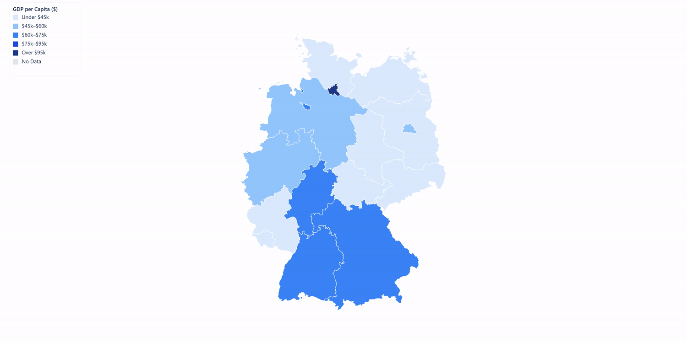
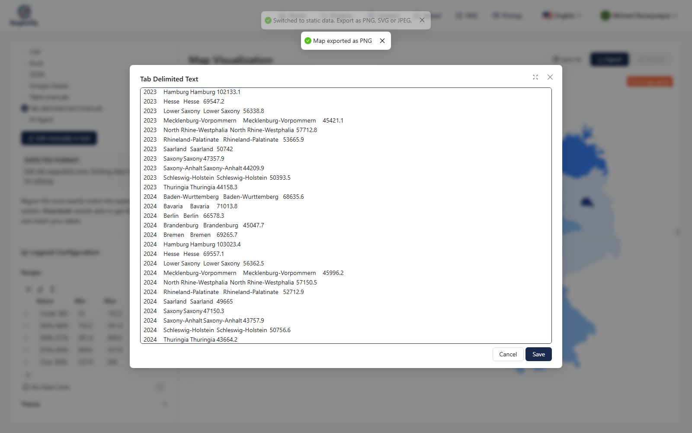
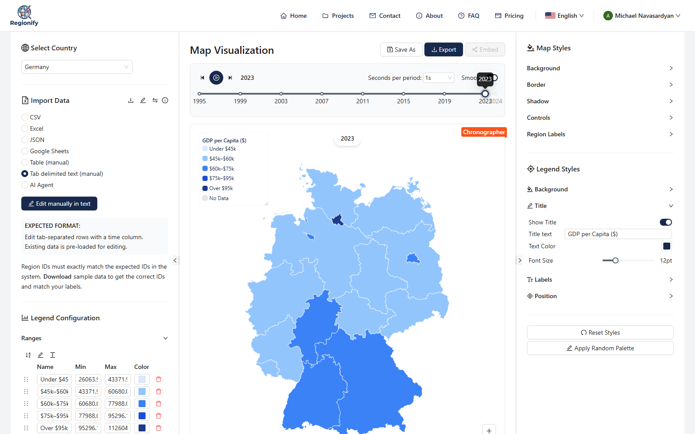
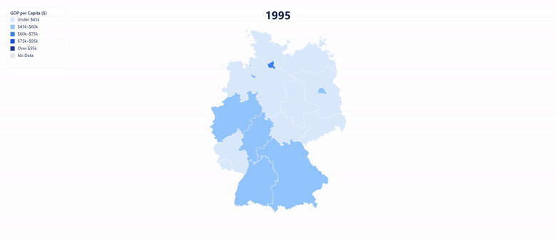
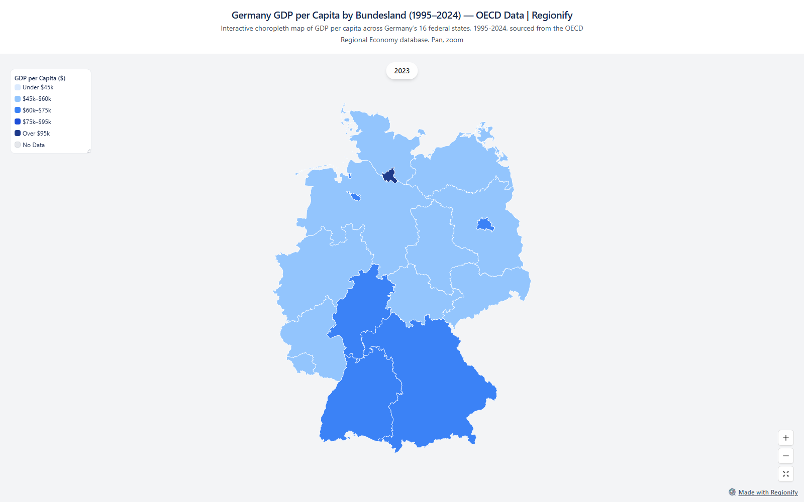

# Medium Article — Regionify Feature Tour (Germany GDP-per-Capita Example)

## Meta

| Field                   | Value                                                                                                                                                                                                                                     |
| ----------------------- | ----------------------------------------------------------------------------------------------------------------------------------------------------------------------------------------------------------------------------------------- |
| Platform                | Medium (submit to a publication — see `../README.md`)                                                                                                                                                                                     |
| Day                     | Tuesday                                                                                                                                                                                                                                   |
| Time slot               | 8-10 AM US Eastern (4-6 PM UTC+4)                                                                                                                                                                                                         |
| Length target           | 750-950 words / ~4 minute read                                                                                                                                                                                                            |
| Tags                    | Data Visualization, Data Journalism, SaaS, JavaScript, No Code                                                                                                                                                                            |
| UTM campaign            | `feature-tour-germany-gdp`                                                                                                                                                                                                                |
| Canonical URL           | The Medium URL itself (set as canonical on dev.to / Hashnode)                                                                                                                                                                             |
| Recommended publication | **Nightingale** (Data Visualization Society's pub) — better audience fit than JS in Plain English for this one, since it's dataviz-led rather than dev-led. JS in Plain English is the fallback if Nightingale's editorial queue is slow. |

---

## Title — pick ONE

**Primary:**

```
Every Regionify Feature, Explained With One Dataset: Germany's Regional GDP
```

**Backup 1 (how-to framing, stronger search intent):**

```
From an OECD Spreadsheet to an Animated Map: A Regionify Feature Tour
```

**Backup 2 (shorter, punchier):**

```
I Mapped Germany's GDP by State. Here's Every Feature That Took.
```

---

## Subtitle — pick ONE

**For Primary:**

```
Import formats, live styling, and the animated-map export that turns 30 years of OECD data into a 10-second GIF.
```

**For Backup 1:**

```
Data types, styling, and the timeline feature that turns any year-by-year spreadsheet into a GIF or MP4.
```

---

## Article body (paste as-is into the Medium editor after picking title/subtitle)

> **Formatting note.** Same as the other Medium article — `##`/`###` become Medium's title styles, no `<h1>`. Preview once before publishing.

---



Hamburg's GDP per capita is $102,133 (PPP-adjusted, 2023). Thuringia's is $44,158. Same country, 2.3× apart — and the line between them still roughly traces the old East-West German border, more than thirty years after reunification.

I made that map in [Regionify](https://regionify.pro/?utm_source=medium&utm_medium=article&utm_campaign=feature-tour-germany-gdp) from a public OECD CSV. Everything below is one feature at a time, using this exact German dataset the whole way through — no toy example, no unemployment-file mislabel, real regional numbers.

### Six ways to get a spreadsheet onto a map

Upload a CSV, an Excel file (`.xlsx`/`.xls`), or JSON. Paste rows into a table or a plain tab-delimited text box. Connect a live Google Sheet — Regionify re-fetches it on load, so the map stays current if the sheet changes. Or, on paid tiers, hand messy region names to the AI parser and confirm its suggested matches before anything binds to the map.

Whichever format you pick, the region-matching and the map underneath are the same 200+ built-in region sets — Germany's 16 Länder, France's régions, US states, and so on.



### A year column is all it takes for a timeline

This is the part that matters most, so it gets its own paragraph instead of a bullet. Any of the six import methods above accepts an optional `year` column. The moment Regionify sees more than one year in your data, it groups the rows into a timeline automatically — a scrub bar appears under the map, no separate "animation mode" to find or learn.

My Germany file is 480 rows, shape `year,id,label,value`, covering 1995 through 2024:

```
year,id,label,value
2023,Hamburg,Hamburg,102133.1
2023,Thuringia,Thuringia,44158.3
2024,Hamburg,Hamburg,103023.4
2024,Thuringia,Thuringia,43664.2
```

That's the whole schema. (Time-series import is an Explorer-tier-and-up feature — the free Observer tier reads the same file but keeps only the most recent year.)

### Style it live

Legend bins, palette, borders, labels, background — every control repaints the map immediately, no rebuild step. I used 5 bins instead of a smooth gradient specifically so the $44k–47k former-East cluster reads as one obvious color block against everything west of it.



### The animated-map opportunity

This is the one I'd actually lead with. A static choropleth is a chart. A choropleth with a scrub bar is a chart you can post as a GIF — and GIFs get shared, replied to, and embedded in ways a PNG doesn't.

Once the timeline exists, press play: Regionify holds the color scale fixed across every frame, so 1995's palette means the same thing as 2024's, and exports the whole sequence as GIF or MP4, up to 4K — no video editor involved. My 30-year Germany animation took about as long to export as it took you to read this paragraph.

And it's not just a nicer-looking chart — the animation tells a story the single frame can't. In 1995, Hamburg was 2.98× Thuringia. By 2023 that ratio had narrowed to 2.31×, even though the dollar gap between them actually widened. Both grew; the East just grew faster off a smaller base. You only see that convergence-with-a-persistent-gap story by watching all 30 frames — a single before/after comparison hides it.

If you've got a spreadsheet with a year column sitting in a folder somewhere, that's an animated map you haven't made yet.



_(Real export note: Regionify's on-canvas overlay is the legend and a per-frame year badge — there's no separate "title" or "source credit" text layer on the map itself. Put those in the surrounding article prose, as above, rather than expecting them baked into the image.)_

### Ship it: export, or publish it live

Two ways to hand off the result. Export a still as PNG, JPEG, or PDF (every tier) or SVG (Explorer and up), resolution up to 4K. Or, on the Chronographer tier, publish the whole project as a public page — its own URL, an iframe embed, and SEO title/description fields you set yourself. Edit the underlying data later and the live embed updates with it; it isn't a one-time snapshot.

```html
<iframe
  src="https://regionify.pro/embed/ythRrjRkUWRHEPras5brYUoiouccq1Gt"
  width="100%"
  height="560"
  style="border:0"
  title="Regionify map"
></iframe>
```

[Open the live embed →](https://regionify.pro/embed/ythRrjRkUWRHEPras5brYUoiouccq1Gt?utm_source=medium&utm_medium=article&utm_campaign=feature-tour-germany-gdp)



### What it costs

**Observer** is free — 5 projects, PNG/JPEG/PDF export, all 200+ region sets, no card required. **Explorer** is $19 once — adds SVG export, the time-series import that makes the animation above possible, GIF/MP4 export, and the AI parser. **Chronographer** is $39 once — adds the public embed. All one-time purchases, no subscription — unlike [Datawrapper](https://www.datawrapper.de/) or [Flourish](https://flourish.studio/), where the watermark-free tier is a recurring monthly cost.

### Try it on your own data

The map at the top took a public OECD CSV, a `year` column, and about the length of this article to produce, animation included. [Regionify](https://regionify.pro/?utm_source=medium&utm_medium=article&utm_campaign=feature-tour-germany-gdp) is free to start — if you've got a regional dataset with a time dimension you've been meaning to visualize, that's the fastest way to see whether the animated-map export is as useful for your data as it was for this one.

---

## Media assets — consolidated brief

| #   | Type         | Placement           | File (relative to this article) | Notes                                               |
| --- | ------------ | ------------------- | ------------------------------- | --------------------------------------------------- |
| 1   | Hero (PNG)   | Top of article      | `germany-hero.png`              | Real 2023 GDP-per-capita map, cropped 2:1           |
| 2   | Screenshot   | "A year column…"    | `germany-import-timeline.png`   | Data-import panel, real rows across 2023/2024       |
| 3   | Screenshot   | "Style it live"     | `germany-styling-panel.png`     | Styled 2023 map, 5-bin $ legend, panels visible     |
| 4   | Animated GIF | "The animated-map…" | `germany-animation-preview.gif` | Compressed for inline embedding (~500 KB, 30 years) |
| 5   | Screenshot   | "Ship it…"          | `germany-embed-page.png`        | The live public embed page                          |

**Source data:** `docs/marketing/assets/data/Germany gdp per capita.csv` — derived from `oecd-gdp-per-capita.csv` (OECD Regional Economy database, `OECD.CFE.EDS:DSD_REG_ECO@DF_GDP`, measure GDP, USD PPP-converted, constant 2020 prices), reshaped into Regionify's `year,id,label,value` import format. 16 Länder × 1995-2024 = 480 rows. Figures spot-checked against this file (Hamburg 2023 = 102133.1, Thuringia 2023 = 44158.3, Hamburg/Thuringia ratio 2.98× in 1995 → 2.31× in 2023).

**Raw downloadable deliverable** (not needed for the Medium post itself):

- `germany-embed-url.txt` / `germany-embed-code.txt` — the live embed URL and iframe snippet

**Regenerating these assets:**

```
pnpm --filter @regionify/marketing exec tsx scripts/playwright-germany-gdp-feature-tour.ts
```

Requires `marketing/.env` with `CLIENT_URL`, `REGIONIFY_EMAIL`, `REGIONIFY_PASSWORD` (Chronographer-tier account). Re-running creates a **new** project + a **new** public embed URL each time — delete the old "Germany — GDP per Capita (1995–2024)" project first if you don't want duplicates (Projects page → search → Delete).

**Important — do not use "Switch to static data" / "Switch to dynamic data" on a project with real data.** Neither button snapshots the current state: `applySwitchToStatic`/`applySwitchToDynamic` in `client/src/components/visualizer/ImportDataPanel/ImportDataPanel.tsx` unconditionally discard the dataset and replace it with fresh random sample values. The generator script works around this by pasting a real, year-less single-year snapshot instead of ever clicking those buttons — see `importSingleYearStaticData` in the script for the exact mechanism.

**Notes:**

- The hero PNG and GIF are clean, watermark-free exports — Chronographer (and Explorer) tier exports don't carry the "Made with Regionify" mark; only the embed page footer link and the in-app UI screenshots show it. Don't add a "watermark visible" check for Assets 1/4 specifically.
- Alt text as specified at each placeholder
- 2023 is the latest non-provisional-looking year to quote in captions if you need a single-year figure; 2024 exists in the data but is marked provisional by OECD

---

## Cross-post checklist (execute 3-5 days after Medium publication)

- [ ] **dev.to** — canonical URL = Medium URL. Tags: `webdev`, `datavisualization`, `showdev`.
- [ ] **Hashnode** — canonical URL = Medium URL. Tags: Data Visualization, No-Code.
- [ ] **LinkedIn** — native post referencing the article (link in first comment), not a LinkedIn Article. Can reuse the Germany hero image.
- [ ] **Reddit** — the Germany GDP animation (Asset 4) is a strong r/dataisbeautiful `[OC][GIF]` candidate on its own, once weeks 1-4 of the existing Reddit calendar (`../../reddit/README.md`) have run — don't post it early and cannibalize the India GDP posts' novelty.

---

## Compliance checklist (before Publish)

- [ ] All 5 tags attached, primary tag = `Data Visualization`
- [ ] Hero image uploaded, alt text set
- [ ] All 4 inline assets inserted at correct placeholders, each with alt text
- [ ] GIF embedded directly (not a broken YouTube link) — confirm it plays inline in Medium's preview
- [ ] Submitted to a Publication (Nightingale first choice, JS in Plain English fallback)
- [ ] Germany figures spot-checked against `docs/marketing/assets/data/Germany gdp per capita.csv` (Hamburg 2023 = 102133.1, Thuringia 2023 = 44158.3)
- [ ] Tier/feature claims spot-checked against `shared/src/constants/badges.ts` (tier privileges were rebalanced recently — re-verify if this article sits unpublished for more than a few weeks)
- [ ] UTM link tested — `feature-tour-germany-gdp` shows up in analytics
- [ ] No AI-tone giveaway phrases ("delve", "in the realm of", "furthermore", "it is important to note", "landscape of")
- [ ] Article read out loud once
- [ ] Reply strategy: check comments daily for the first 7 days
